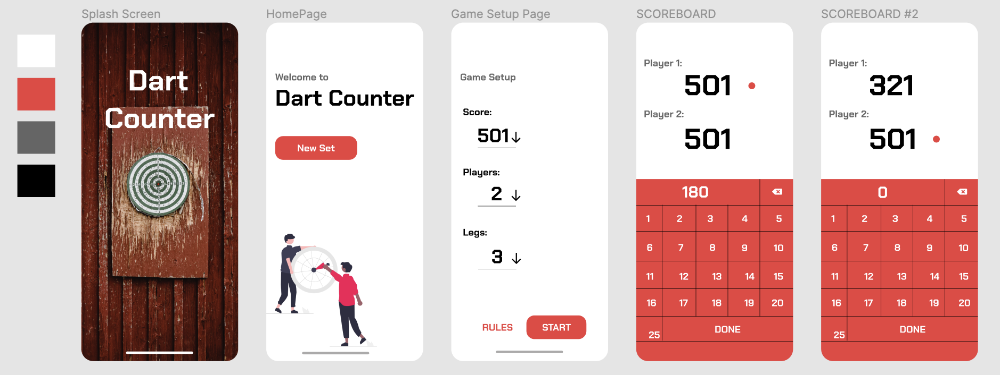
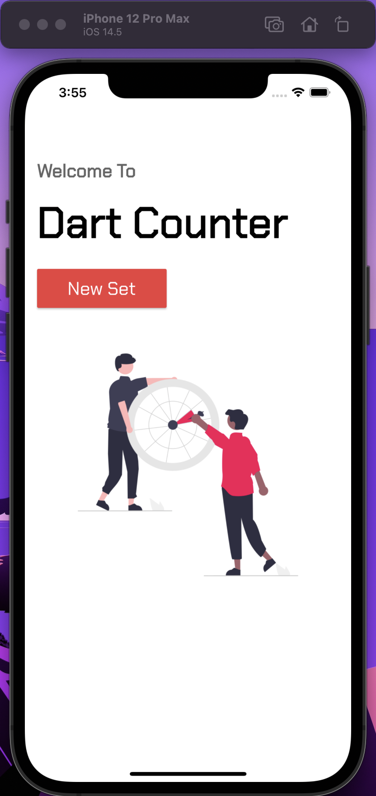
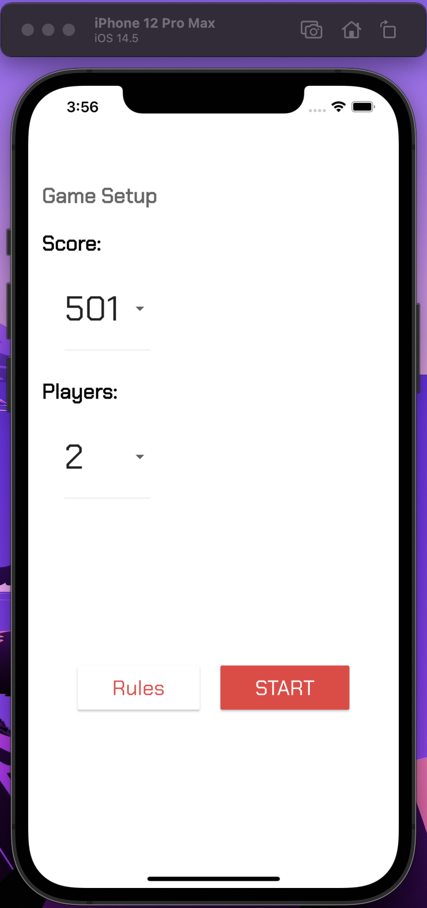
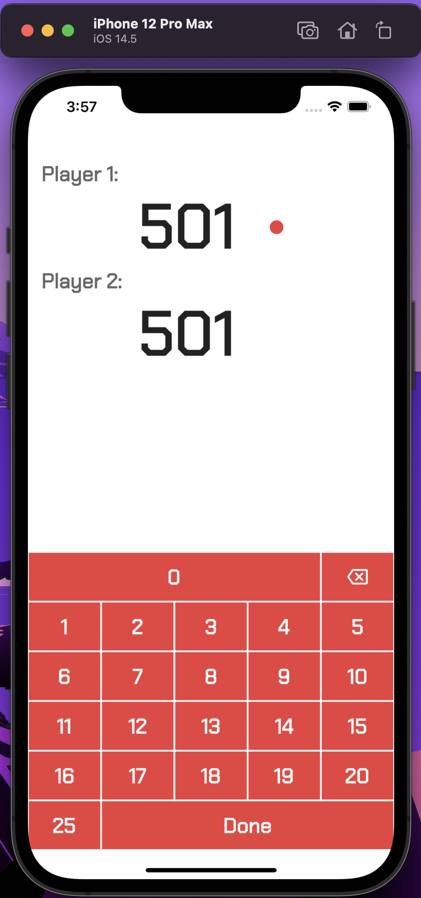
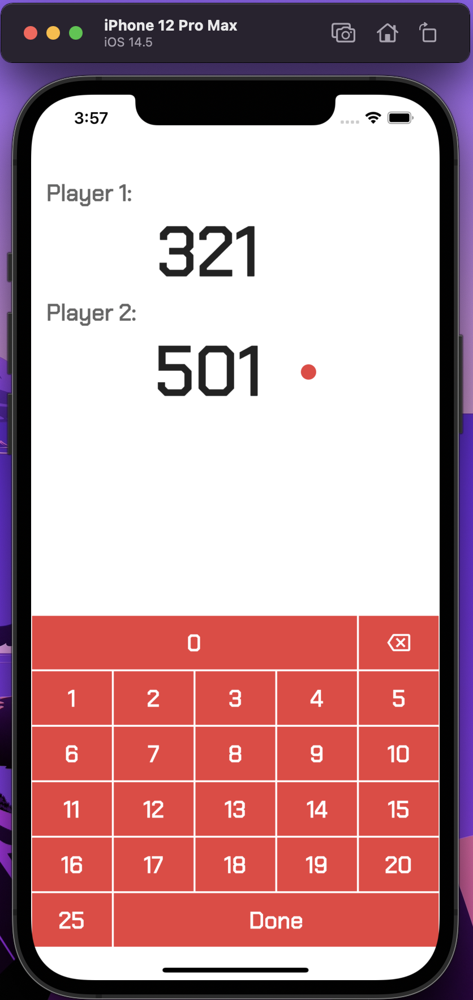

# DartCounter 🎯

A cross-platform Flutter application used to keep score for a the game of Darts.


## Authors

- [@bmteasdale](https://www.github.com/bmteasdale)


## Tech Stack

**UI:** Flutter, Dart


## Acknowledgements

 - [Google Fonts ~ Chakra Petch](https://fonts.google.com/specimen/Chakra+Petch?preview.text=Dart%20Counter&preview.text_type=custom)
 - [get ~ Flutter Package](https://pub.dev/packages/get)
 - [unDraw.co ~ Illustrations](https://undraw.co/)

## Color Reference

| Color             | Hex                                                                |
| ----------------- | ------------------------------------------------------------------ |
| Black |  #FFFFFF |
| Red |  #EB3E3E |
| Grey |  #656565 |
| White |  #000000 |


## Run Locally

Install Flutter on your system at the following link:
https://docs.flutter.dev/get-started/install

Clone the project

```bash
$ git clone https://github.com/bmteasdale/dart-score-counter.git
```

Go to the project directory

```bash
$ cd dart_score_counter
```

Install packages

```bash
$ flutter pub get
```
\
*Open a simulator from Simulator (macOS) or Android Studio Emulator*
\
\
Start the application

```bash
$ flutter run
```


## Figma Mockup

Designed using [Figma](https://www.figma.com/), the collaborative design tool.




## Simulator Screenshots







